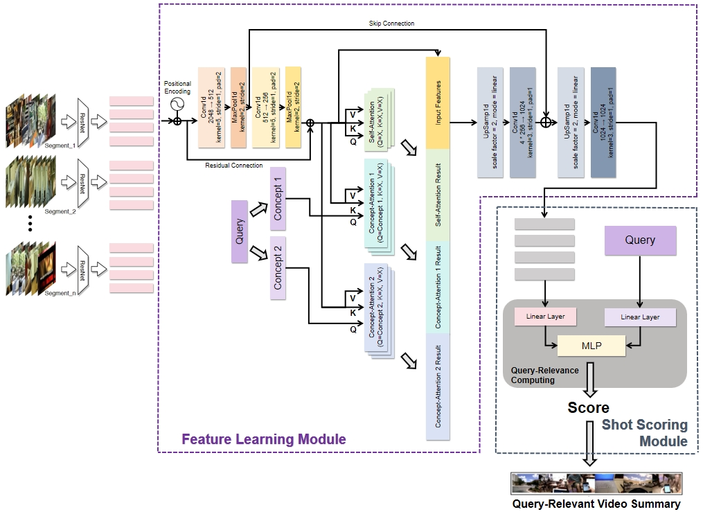

# Summarize Your Search: A Temporal Convolutional Hierarchical Attention Network （TCHAN）for Long Video Summarization


## Overview
This project implements the **Temporal Convolutional Hierarchical Attention Network (TCHAN)**, a query-focused video summarization model that enhances video content extraction based on user queries. TCHAN builds upon the [CHAN](https://github.com/ckczzj/CHAN) architecture with four key improvements:

- Temporal positional encoding to maintain sequence order information
- Residual and skip connections for preserving information across network layers
- Multi-head attention mechanism for parallel processing of feature relationships
- Improved upsampling technique that replaces transposed convolutions

The model achieves state-of-the-art performance on the [QFVS benchmark dataset](https://arxiv.org/pdf/1707.04960) with **48.30% precision**, **55.50% recall**, and **50.00% F1-score**, demonstrating its effectiveness in generating personalized video summaries that align with user intent.



## Prerequisites

- Python 3.11
- PyTorch 2.1.0
- matlab.engine
- gensim
- h5py

## Installation
**1. Install the MATLAB Engine API for Python by following the instructions provided  [here](https://www.mathworks.com/help/matlab/matlab_external/install-the-matlab-engine-for-python.html)**

**2. Create the Conda Environment:**

Run the following command to create a new Conda environment named TCHAN
```
conda create --name TCHAN python=3.11
```

**3. Activate the Environment:**

After the environment is created, activate it with the following command:
```
conda activate TCHAN
```
**4. Install Dependencies:**

Install the dependencies listed in the `requirements.txt` using pip:
```
pip install -r requirements.txt
```

**5. Dataset Download**
Download and unzip [UTC_feature.zip](https://drive.google.com/file/d/1np6d59s27PASZK7yjdnnvkmqT1cPeotO/view?usp=sharing) and place it at `./data/`

**6. Embedding Preparation**
Download and unzip [glove.840B.300d.zip](http://nlp.stanford.edu/data/glove.840B.300d.zip) and place it at `./data/glove.bin`


## Usage

**1. Ensure the files in the data folder are placed as shown below:**
```
data
├─features
├─origin_data
├─processed
└─glove.bin
```

**2. Please Modify the `config.json` file in config folder for experimental setting**

**3. Run and train the model:**

After installation is complete, run the following command to train the model:
```
python main.py
```


